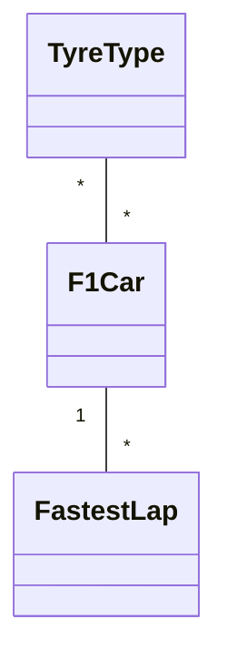
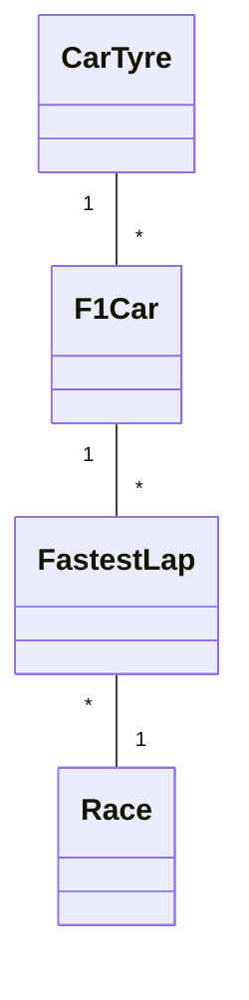

# F1 Project - Project .NET Framework

* Naam: Maxime Blondeel
* Studentennummer: 0167489-67
* Academiejaar: 24-25
* Klasgroep: INF202B
* Onderwerp: TyreType *-* F1Car 1-* FastestLap
## Sprint 1


## Sprint 3

### Beide zoekcriteria ingevuld
```sql
SELECT "f"."Id", "f"."Circuit", "f"."AirTemperature", "f"."TrackTemperature", "f"."LapTime", "f"."DateOfRecord"
FROM "FastestLaps" AS "f"
WHERE instr("f"."Circuit", @__circuit_0) > 0 AND "f"."LapTime" = @__lapTime_1
```

### Enkel zoeken op naam
```sql
SELECT "f"."Id", "f"."Circuit", "f"."AirTemperature", "f"."TrackTemperature", "f"."LapTime", "f"."DateOfRecord"
FROM "FastestLaps" AS "f"
WHERE instr("f"."Circuit", @__circuit_0) > 0
```

### Enkel zoeken op geboortedatum
```sql
SELECT "f"."Id", "f"."Circuit", "f"."AirTemperature", "f"."TrackTemperature", "f"."LapTime", "f"."DateOfRecord"
FROM "FastestLaps" AS "f"
WHERE "f"."LapTime" = @__lapTime_0
```

### Beide zoekcriteria leeg
```sql
SELECT "f"."Id", "f"."Circuit", "f"."AirTemperature", "f"."TrackTemperature", "f"."LapTime", "f"."DateOfRecord"
FROM "FastestLaps" AS "f"
```

## Sprint 4



## Sprint 6

### Nieuwe Fastest Lap

#### Request

```http request
POST http://localhost:5000/api/FastestLapApi
Content-Type: application/json

{
  "circuit": "Monaco GP",
  "airTemperature": 25,
  "trackTemperature": 35,
  "lapTime": "1.11.223",
  "dateOfRecord": "2023-05-28T00:00:00",
  "car": {
    "id": 1
  },
  "race": {
    "id": 1
  }
}
```
#### Response

```http response

HTTP/1.1 201 Created
Content-Type: application/json
Location: /api/FastestLapApi/1

{
  "id": 1,
  "circuit": "Monaco GP",
  "airTemperature": 25,
  "trackTemperature": 35,
  "lapTime": "1.11.223",
  "dateOfRecord": "2023-05-28T00:00:00",
  "car": {
    "id": 1,
    "chasis": "RB19",
    ...
  },
  "race": {
    "id": 1,
    "name": "Monaco GP",
    ...
  }
}
```

## Sprint 7

#### Gebruikers
```
admin - Admin123! - Admin
gebruiker1 - Gebruiker_1234 - User
gebruiker2 - Gebruiker_1234 - None
gebruiker3 - Gebruiker_1234 - None
gebruiker4 - Gebruiker_1234 - None
gebruiker5 - Gebruiker_1234 - None
```
#### Request 1

```
# @no-redirect
# @no-cookie-jar
POST http://localhost:5074/api/TyreApi/AddTyreToCar
Accept: application/json
Content-Type: application/json

{
"CarId": 4,
"Tyre": "Soft",
"TyrePressure": 40,
"OperationalTemperature": 120
}
```
#### Response 1

```
POST http://localhost:5074/api/TyreApi/AddTyreToCar

HTTP/1.1 401 Unauthorized
Content-Type: application/problem+json; charset=utf-8
Date: Wed, 26 Feb 2025 15:08:15 GMT
Server: Kestrel
Transfer-Encoding: chunked

{
  "$id": "1",
  "type": "https://tools.ietf.org/html/rfc9110#section-15.5.2",
  "title": "Unauthorized",
  "status": 401,
  "traceId": "00-c0d8bd2bec6a9d8d4aea1d1769c838ae-fcd642c9b67c664a-01"
}
```
#### Request 2

```
# @no-redirect
# @no-cookie-jar
POST http://localhost:5074/api/TyreApi/AddTyreToCar
Accept: application/json
Content-Type: application/json
Cookie: .AspNetCore.Identity.Application=CfDJ8Oq_I2pcZ-FMjnYECwRapLv-pbmbi6YoQosG1pJjqjVS2UftJ1R3Dx_8EXi7GyZ_SVcRD5qhe-RuA6fZAyUSUIUEuOi58AIr3C1Cbw9OGjZFXHj7bSIKhYQfxVhlck59xkKoB_V26aKtPJvhDHEDfeELGM2ix0_5yf-rTrSD2jiG8b86KFxMRgKMcJP_dPW0t3bMFcpfF88K7XVpjbc5jGRCqVbjG8R1qgR8azoFQbqbTEXEQakXZ29eFeG8E5Rw9MFXbILXIyl-hho23wgmTqewOGDoHLqqBmIp9qkd4BpABjj7MYUFUdYqr6pSj2Cnzb7qpqULOhE4s9JN5mvvgm91bDIC56kTU4sMjXnDD6xJubOjLtoMsuxtCuQD6O-fmTl3KPzBm3urQG5VyM7p-EN9Zi_oewb-tEzOuTuDUVbYLEOG9DiNKaH_58EhU3g8d5-K6dNA2qh6e_uXOmfIYf27PZnpj_zaQxrqEtuiHATiDTXQPZOPMWWFEXwjolFSGABvpYSxxcL9OvMIMMOctYfg8vRZIdyDMGG7Ew8gHe56KZK0SWZfhmcqxuhhAly_us7v19GFt2qJMmG8uNm8wjzdKc5Zp4c52sLOFBBjVUzWbRM9-A2dlP_4uFOajXW5gUW4WGfPb35S60ZMDP1nE3DtN089jh2enAlMAGNQCwzHH3uMhgMDK1SIlf8fXxlqSdPJvkpA9LUm6-JPjY-ZHHCl6eSrD1_G4twD2p5AUNpV59FpsVQwWoSpF2M8P24KQT6rWILQH3NI3BStjeLAFjg-MGlRjzgfrpm7BfwrBQTEd0ACb_lbalPu0L8ZXbXUhvpte_NzGUyDlrycinkTapkCookie: .AspNetCore.Antiforgery.xPQZ6ly-kNk=CfDJ8Oq_I2pcZ-FMjnYECwRapLuLxEWrNme1-IsTkpbEdF6yDZq1uvmNilFTL3LMte8Oa4n2rohlKcTZLv5UcYDD_Bp5E46snUtAwcq7qmoKm0QlIGvUAX6El8jrsIRhglFQZTDlpdCD9pBnTyk0YKCBzJk
Cookie: .AspNetCore.Antiforgery.xPQZ6ly-kNk=CfDJ8Oq_I2pcZ-FMjnYECwRapLuLxEWrNme1-IsTkpbEdF6yDZq1uvmNilFTL3LMte8Oa4n2rohlKcTZLv5UcYDD_Bp5E46snUtAwcq7qmoKm0QlIGvUAX6El8jrsIRhglFQZTDlpdCD9pBnTyk0YKCBzJk

{
  "CarId": 1,
  "Tyre": "Soft",
  "TyrePressure": 40,
  "OperationalTemperature": 120
}
```
#### Response 2

```
HTTP/1.1 201 Created
Content-Type: application/json; charset=utf-8
Date: Wed, 26 Feb 2025 14:44:25 GMT
Server: Kestrel
Location: http://localhost:5074/api/TyreApi/GetTyresForCar/4
Transfer-Encoding: chunked

{
  "$id": "1",
  "carId": 4,
  "tyre": "Soft",
  "tyrePressure": 40,
  "operationalTemperature": 120
}
```
## Sprint 8
```shell
dotnet test
```
