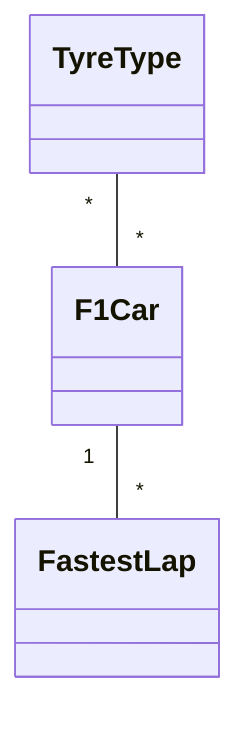
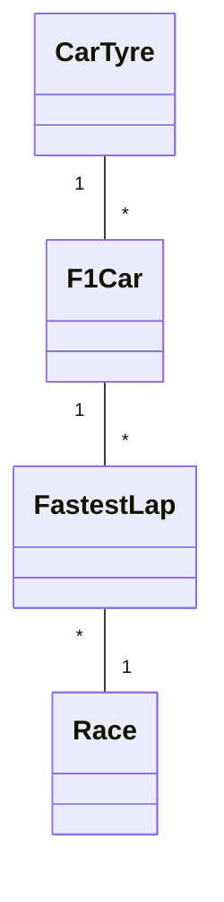

# F1 Project - Project .NET Framework

* Naam: Maxime Blondeel
* Studentennummer: 0167489-67
* Academiejaar: 24-25
* Klasgroep: INF202B
* Onderwerp: TyreType *-* F1Car 1-* FastestLap
## Sprint 1


## Sprint 3

### Beide zoekcriteria ingevuld
```sql
SELECT "f"."Id", "f"."Circuit", "f"."AirTemperature", "f"."TrackTemperature", "f"."LapTime", "f"."DateOfRecord"
FROM "FastestLaps" AS "f"
WHERE instr("f"."Circuit", @__circuit_0) > 0 AND "f"."LapTime" = @__lapTime_1
```

### Enkel zoeken op naam
```sql
SELECT "f"."Id", "f"."Circuit", "f"."AirTemperature", "f"."TrackTemperature", "f"."LapTime", "f"."DateOfRecord"
FROM "FastestLaps" AS "f"
WHERE instr("f"."Circuit", @__circuit_0) > 0
```

### Enkel zoeken op geboortedatum
```sql
SELECT "f"."Id", "f"."Circuit", "f"."AirTemperature", "f"."TrackTemperature", "f"."LapTime", "f"."DateOfRecord"
FROM "FastestLaps" AS "f"
WHERE "f"."LapTime" = @__lapTime_0
```

### Beide zoekcriteria leeg
```sql
SELECT "f"."Id", "f"."Circuit", "f"."AirTemperature", "f"."TrackTemperature", "f"."LapTime", "f"."DateOfRecord"
FROM "FastestLaps" AS "f"
```

## Sprint 4



## Sprint 6

### Nieuwe Fastest Lap

#### Request

```http request
POST http://localhost:5000/api/FastestLapApi
Content-Type: application/json

{
  "circuit": "Monaco GP",
  "airTemperature": 25,
  "trackTemperature": 35,
  "lapTime": "1.11.223",
  "dateOfRecord": "2023-05-28T00:00:00",
  "car": {
    "id": 1
  },
  "race": {
    "id": 1
  }
}
```
#### Response

```http response

HTTP/1.1 201 Created
Content-Type: application/json
Location: /api/FastestLapApi/1

{
  "id": 1,
  "circuit": "Monaco GP",
  "airTemperature": 25,
  "trackTemperature": 35,
  "lapTime": "1.11.223",
  "dateOfRecord": "2023-05-28T00:00:00",
  "car": {
    "id": 1,
    "chasis": "RB19",
    ...
  },
  "race": {
    "id": 1,
    "name": "Monaco GP",
    ...
  }
}
```


