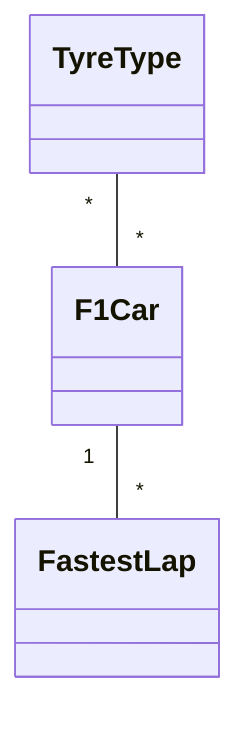
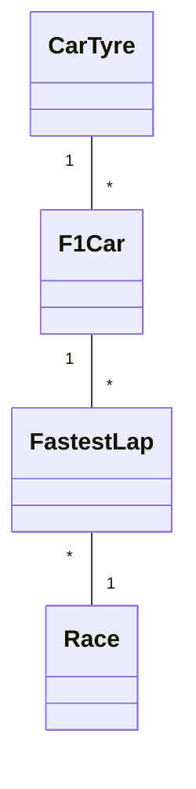

# F1 Project - Project .NET Framework

* Naam: Maxime Blondeel
* Studentennummer: 0167489-67
* Academiejaar: 24-25
* Klasgroep: INF202B
* Onderwerp: TyreType *-* F1Car 1-* FastestLap
## Sprint 1


## Sprint 3

### Beide zoekcriteria ingevuld
```sql
SELECT "f"."Id", "f"."Circuit", "f"."AirTemperature", "f"."TrackTemperature", "f"."LapTime", "f"."DateOfRecord"
FROM "FastestLaps" AS "f"
WHERE instr("f"."Circuit", @__circuit_0) > 0 AND "f"."LapTime" = @__lapTime_1
```

### Enkel zoeken op naam
```sql
SELECT "f"."Id", "f"."Circuit", "f"."AirTemperature", "f"."TrackTemperature", "f"."LapTime", "f"."DateOfRecord"
FROM "FastestLaps" AS "f"
WHERE instr("f"."Circuit", @__circuit_0) > 0
```

### Enkel zoeken op geboortedatum
```sql
SELECT "f"."Id", "f"."Circuit", "f"."AirTemperature", "f"."TrackTemperature", "f"."LapTime", "f"."DateOfRecord"
FROM "FastestLaps" AS "f"
WHERE "f"."LapTime" = @__lapTime_0
```

### Beide zoekcriteria leeg
```sql
SELECT "f"."Id", "f"."Circuit", "f"."AirTemperature", "f"."TrackTemperature", "f"."LapTime", "f"."DateOfRecord"
FROM "FastestLaps" AS "f"
```

## Sprint 4




